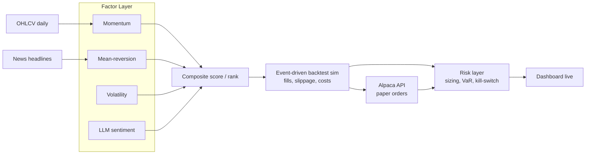

# Systematic Alpha Research & Paper-Trading Platform

A factor-based signal research pipeline, event-driven backtesting engine, and live paper-trading system for systematic equity strategies. Built to demonstrate the full path from research to production: signal construction, walk-forward validation, risk-controlled execution, and live monitoring.

> **Status**: [In Development / Backtest Complete / Live on Paper Trading] — update as you progress.

---

## Table of Contents
1. [Motivation](#motivation)
2. [System Architecture](#system-architecture)
3. [Data](#data)
4. [Factor Methodology](#factor-methodology)
5. [Signal Combination](#signal-combination)
6. [Backtest Engine](#backtest-engine)
7. [Risk Management](#risk-management)
8. [Live Paper Trading](#live-paper-trading)
9. [Results](#results)
10. [Dashboard](#dashboard)
11. [Tech Stack](#tech-stack)
12. [Setup & Usage](#setup--usage)
13. [Limitations & Assumptions](#limitations--assumptions)
14. [Future Work](#future-work)
15. [Repository Structure](#repository-structure)

---

## Motivation

Most academic backtests overstate strategy performance because they ignore execution realism: slippage, transaction costs, and look-ahead bias creep in through vectorized computation over the full dataset at once. This project is built the opposite way, event by event, so the strategy only ever sees information that would have been available at that point in time. The end goal isn't a backtest with a nice Sharpe ratio, it's a system that could plausibly run unattended against real capital, with the risk controls to survive being wrong.

The strategy also folds in a non-price signal, LLM-scored news sentiment, to test whether unstructured text data adds information beyond what's already in price and volume.

---

## System Architecture



Data flows one direction: raw data → factors → combined signal → simulated or live execution → risk overlay → reporting. Each stage is a separate module so factors, execution logic, and risk rules can be tested independently.

---

## Data

- **Universe**: [e.g., ~50 large-cap US equities across 3–4 sectors — name the actual sectors once chosen]
- **Price data**: daily OHLCV, [X] years of history, sourced via [yfinance / Polygon], cached locally as parquet to avoid repeated API calls.
- **News data**: daily headlines per ticker, sourced via [News API / Polygon news endpoint].
- **Point-in-time discipline**: all data is timestamped and joined so that on any given simulated day, the strategy only accesses information dated on or before that day. This is the most common source of inflated backtest results, so it's treated as a hard constraint, not an afterthought.
- **Survivorship bias**: [note whether your universe includes delisted/acquired names — if not, disclose this as a known limitation]

---

## Factor Methodology

Each factor is implemented as a standalone, independently testable function that takes a price/news panel and returns a cross-sectional score per ticker per day.

### Momentum
Rationale: assets that have outperformed over the recent past tend to continue outperforming over intermediate horizons (12-1 month momentum is the classic formulation, skipping the most recent month to avoid short-term reversal effects).
- Formula: [e.g., 12-month return excluding the most recent month]
- Lookback: [specify]

### Mean-Reversion
Rationale: over short horizons, extreme price moves partially reverse, particularly in the absence of new fundamental information.
- Formula: [e.g., z-score of 5-day return relative to 60-day rolling mean/std]
- Lookback: [specify]

### Volatility
Rationale: lower-volatility names have historically delivered better risk-adjusted returns than the CAPM would predict (the "low-volatility anomaly"). Used here both as a standalone signal and as an input to position sizing.
- Formula: [e.g., trailing 60-day realized volatility, inverse-ranked]

### LLM Sentiment
Rationale: news sentiment may capture information not yet reflected in price, particularly for lower-coverage names.
- Method: daily headlines per ticker are scored by [Qwen2.5-1.5B-Instruct / GPT-4o-mini] on a [-1, +1] polarity scale, prompted with [brief description of the prompt strategy], then aggregated to a daily per-ticker score.
- Validation: sentiment scores are checked against a labeled subset for prompt reliability before being trusted as a factor input.

### Factor Validation
Each factor is evaluated independently before combination, using:
- **Information Coefficient (IC)**: rank correlation between the factor score and forward N-day returns.
- **IC decay**: how quickly the factor's predictive power fades across increasing forward horizons.
- **Factor turnover**: how often the ranking changes day to day, since high turnover implies higher transaction costs to actually capture the signal.

---

## Signal Combination

Individual factor scores are combined into a single composite score per ticker per day.
- **Method**: [e.g., z-score each factor cross-sectionally, then combine via equal weighting or IC-weighted combination]
- **Ranking**: tickers are ranked by composite score; the strategy goes long the top decile and short the bottom decile (or long-only top decile, if short selling is out of scope for the paper account).
- **Rebalancing frequency**: [daily / weekly] — chosen to balance signal freshness against transaction costs.

---

## Backtest Engine

Built as an event-driven simulator rather than a vectorized backtest, meaning the engine steps through time bar by bar and only acts on information available at that bar. This is slower to run but avoids several classes of look-ahead bias that vectorized backtests can silently introduce.

- **Order fills**: filled at [next-day open / VWAP approximation], not the signal-day close, to avoid unrealistic same-bar execution.
- **Transaction costs**: modeled as [X bps] per trade, calibrated to typical retail/institutional equity commission + spread costs.
- **Slippage**: modeled as a function of [trade size relative to average daily volume], since large orders in low-liquidity names should cost more to execute.
- **Walk-forward validation**: the strategy is validated on rolling out-of-sample windows (e.g., train factor weights on a trailing window, test on the following unseen window, roll forward) rather than a single in-sample fit, to reduce overfitting risk.

---

## Risk Management

- **Position sizing**: [vol-targeting — position sizes are inversely scaled to each name's realized volatility, so no single volatile name dominates portfolio risk].
- **Portfolio-level risk limits**: max gross exposure, max exposure per name, max exposure per sector.
- **Value at Risk (VaR)**: computed both historically (empirical return distribution) and parametrically (variance-covariance method), reported daily.
- **Kill-switch**: if realized drawdown exceeds [X]%, the strategy automatically flattens all positions and halts new order generation until manually reviewed. This is the single most important piece of the system from a "would a risk manager trust this" standpoint — a good signal with no downside control is not a fundable strategy.

---

## Live Paper Trading

- **Execution venue**: Alpaca paper trading API (no real capital at risk).
- **Cadence**: signal recomputed and orders placed daily via a scheduled GitHub Actions job.
- **Logging**: every order, fill, and daily portfolio snapshot is logged to [SQLite / Google Sheet / Postgres] for later analysis and for the dashboard to read from.
- **Live vs. backtest reconciliation**: live paper P&L is compared against what the backtest would have predicted for the same period, to sanity-check that the production pipeline matches the research pipeline (a common failure mode is a subtle mismatch between backtest and live logic).

---

## Results

> Fill in once the strategy has run. Keep both the backtest and live sections — an interviewer will likely ask about the gap between them.

### Backtest (in-sample + walk-forward out-of-sample)
| Metric | Value |
|---|---|
| CAGR | |
| Sharpe Ratio | |
| Sortino Ratio | |
| Max Drawdown | |
| Win Rate | |
| Avg Holding Period | |

### Live Paper Trading (as of [date])
| Metric | Value |
|---|---|
| Days Live | |
| Cumulative P&L | |
| Realized Sharpe (annualized) | |
| Max Drawdown (live) | |

### Factor Attribution
Which factors contributed most to returns — worth a short paragraph plus a chart in the dashboard, since "which signal is actually doing the work" is a near-certain interview question.

---

## Dashboard

Live view of the strategy, showing:
- Equity curve (live vs. backtested expectation)
- Current positions and sector exposure
- Rolling Sharpe, drawdown, and VaR
- Factor score breakdown per holding

Built with [Streamlit / React + FastAPI], deployed at [URL].

---

## Tech Stack

- **Data & research**: Python, Pandas, NumPy, yfinance/Polygon
- **NLP/sentiment**: [Qwen2.5-1.5B-Instruct / GPT-4o-mini], transformers
- **Backtesting**: custom event-driven engine (no external backtest library, to keep full control over fill/cost assumptions)
- **Execution**: Alpaca Trade API
- **Scheduling**: GitHub Actions (cron)
- **Dashboard**: [Streamlit / React (Vite) + FastAPI]
- **Deployment**: [Render / Vercel]
- **Storage**: [SQLite / Postgres]

---

## Setup & Usage

```bash
git clone <repo-url>
cd alpha-platform
python3.11 -m pip install -r requirements.txt

# Configure API keys
cp .env.example .env   # add Alpaca keys, news API key, LLM API key

# Run factor research
jupyter notebook notebooks/research.ipynb

# Run a backtest
python -m backtest.engine --start 2020-01-01 --end 2025-01-01

# Start live paper trading (scheduled via GitHub Actions, or run manually)
python -m live.scheduler

# Launch dashboard
streamlit run dashboard/app.py
```

---

## Limitations & Assumptions

Being upfront about these matters more than hiding them, since a reviewer who catches an unstated assumption will trust the rest of the results less.

- Universe is limited to [X] liquid large-cap names; results may not generalize to small-caps or less liquid markets.
- [Survivorship bias present/absent] — state clearly.
- Transaction cost and slippage models are estimates, not exchange-verified fill data.
- Paper trading does not capture real market impact, especially for larger position sizes than were ever actually tested.
- Backtest period [does/does not] span a full market cycle including a significant drawdown regime; performance in an untested regime (e.g., a sharp rate-hike cycle, a liquidity crisis) is unknown.
- LLM sentiment scoring is a single-model, single-prompt approach and has not been benchmarked against alternative sentiment methodologies (e.g., FinBERT).

---

## Future Work

- Extend universe to include international equities or a broader small/mid-cap set.
- Add a regime-detection layer (e.g., volatility regime classification) to adjust factor weights dynamically rather than statically.
- Benchmark the LLM sentiment factor against FinBERT or a traditional lexicon-based sentiment score.
- Move from paper trading to a small live-capital pilot with strict position limits.
- Add options overlay for tail-risk hedging during high-VaR periods.

---

## Repository Structure

```
alpha-platform/
├── data/
├── factors/
├── backtest/
├── risk/
├── live/
├── dashboard/
├── notebooks/
├── tests/
├── .github/workflows/
├── requirements.txt
└── README.md
```
