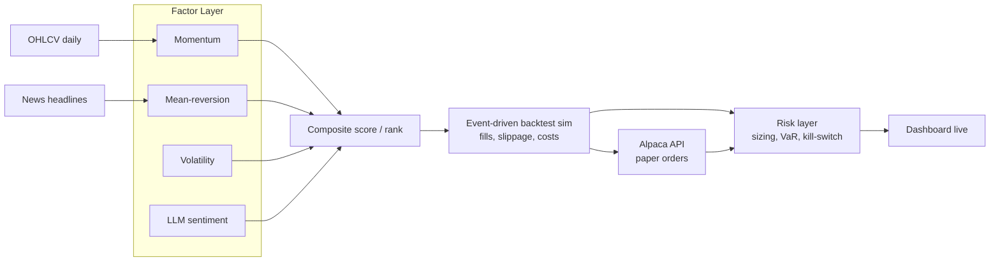

# Systematic Alpha Research & Paper-Trading Platform

A factor-based signal research pipeline, event-driven backtesting engine, and live paper-trading system for systematic equity strategies. Built to demonstrate the full path from research to production: signal construction, walk-forward validation, risk-controlled execution, and live monitoring.

> **Status**: Backtest complete (sample run committed under `backtest/results/`). Not yet live on paper trading — `live/` is built and unit-tested but has never been run against a funded Alpaca paper account.

---

## Table of Contents
1. [Motivation](#motivation)
2. [System Architecture](#system-architecture)
3. [Data](#data)
4. [Factor Methodology](#factor-methodology)
5. [Signal Combination](#signal-combination)
6. [Backtest Engine](#backtest-engine)
7. [Risk Management](#risk-management)
8. [Live Paper Trading](#live-paper-trading)
9. [Results](#results)
10. [Dashboard](#dashboard)
11. [Tech Stack](#tech-stack)
12. [Setup & Usage](#setup--usage)
13. [Limitations & Assumptions](#limitations--assumptions)
14. [Future Work](#future-work)
15. [Repository Structure](#repository-structure)

---

## Motivation

Most academic backtests overstate strategy performance because they ignore execution realism: slippage, transaction costs, and look-ahead bias creep in through vectorized computation over the full dataset at once. This project is built the opposite way, event by event, so the strategy only ever sees information that would have been available at that point in time. The end goal isn't a backtest with a nice Sharpe ratio, it's a system that could plausibly run unattended against real capital, with the risk controls to survive being wrong.

The strategy also folds in a non-price signal, LLM-scored news sentiment, to test whether unstructured text data adds information beyond what's already in price and volume.

---

## System Architecture



Data flows one direction: raw data → factors → combined signal → simulated or live execution → risk overlay → reporting. Each stage is a separate module so factors, execution logic, and risk rules can be tested independently.

---

## Data

- **Universe**: 49 large-cap US equities across four sectors — Technology, Healthcare, Financials, Energy — hardcoded in `config/universe.py`. (Originally 50; Hess (`HES`) was dropped after its 2024 acquisition by Chevron made it undownloadable, and wasn't replaced 1:1.)
- **Price data**: daily OHLCV, sourced via `yfinance` for research/backtesting and Alpaca Market Data for the live loop, cached locally as parquet (`data/cache/`) to avoid repeated API calls. Sample backtest below covers 2020-01-01 to 2025-01-01.
- **News data**: daily headlines per ticker, sourced via NewsAPI.org for backtesting/research and Alpaca's Benzinga-sourced news feed for live trading.
- **Point-in-time discipline**: all data is timestamped and joined so that on any given simulated day, the strategy only accesses information dated on or before that day. This is the most common source of inflated backtest results, so it's treated as a hard constraint, not an afterthought.
- **Survivorship bias**: present. The universe is the *current* set of constituents; no delisted or acquired names are included (see the Hess example above, which shows this isn't hypothetical). Backtest returns are likely modestly overstated as a result.

### Data Access

**Price data**
- **Alpaca Market Data API** — primary source. Real-time and historical equity data (up to 6+ years), bundled with the same account used for paper trading, so one API key covers both data and execution. The free Basic plan is zero-cost and sufficient for this project (IEX-feed real-time data, full historical bars).
- **yfinance** (`pip install yfinance`) — used for fast local prototyping in the research notebooks; no API key required. Backtest/research work starts here since it's the quickest to iterate with.
- **Polygon.io** — optional secondary source for cross-checking Alpaca data or finer intraday granularity later. Free tier available with rate limits.

**News data**
- **NewsAPI.org** — free developer tier, headline search by keyword/ticker/date. Used as the input to the LLM sentiment factor.
- **Alpaca News API** — bundled Benzinga-sourced news feed, available under the same Alpaca account as the price data.
- **Polygon news endpoint** — optional, ties in if already using Polygon for prices.

**Account setup**
1. Create a free Alpaca account at [alpaca.markets](https://alpaca.markets) — paper trading only, no funding required, available globally with just an email signup.
2. Generate an API key/secret from the Alpaca dashboard (paper trading keys, not live).
3. Sign up for a free NewsAPI key at [newsapi.org](https://newsapi.org).
4. Store all keys in a local `.env` file (never committed) — see [Setup & Usage](#setup--usage) for the expected variable names.

**Suggested split**: use `yfinance` for the Week 1 research/backtest notebooks (fastest to prototype with), then switch the live pipeline over to Alpaca's data API in Week 3, since order execution already requires an Alpaca account — using the same provider for both backtest-replay and live data reduces the risk of a mismatch between the two.

---

## Factor Methodology

Each factor is implemented as a standalone, independently testable function that takes a price/news panel and returns a cross-sectional score per ticker per day.

### Momentum (`factors/momentum.py`)
Rationale: assets that have outperformed over the recent past tend to continue outperforming over intermediate horizons (12-1 month momentum is the classic formulation, skipping the most recent month to avoid short-term reversal effects).
- Formula: 252-trading-day return, skipping the most recent 21 trading days.
- Lookback: 252 trading days (~12 months), 21-day skip window.

### Mean-Reversion (`factors/mean_reversion.py`)
Rationale: over short horizons, extreme price moves partially reverse, particularly in the absence of new fundamental information.
- Formula: negated z-score of the trailing 5-day return relative to its trailing 60-day rolling mean/std (so a sharp recent drop scores high, i.e. expected to bounce).
- Lookback: 5-day return window, 60-day rolling mean/std window (minimum 20 periods before scoring starts).

### Volatility (`factors/volatility.py`)
Rationale: lower-volatility names have historically delivered better risk-adjusted returns than the CAPM would predict (the "low-volatility anomaly"). Used here both as a standalone signal and, independently, as an input to risk-layer position sizing (`risk/sizing.py`) — a name can be favored by this factor while still being sized down for portfolio-level risk reasons.
- Formula: trailing 60-day annualized realized volatility, inverse cross-sectional rank (lowest vol = highest score).

### LLM Sentiment (`factors/sentiment.py`)
Rationale: news sentiment may capture information not yet reflected in price, particularly for lower-coverage names.
- Method: each headline is scored independently by GPT-4o-mini on a [-1, +1] polarity scale (prompted to return only the number), then aggregated to a daily per-ticker mean. Per-headline scores are cached (keyed by a hash of the headline text) so the same headline is never re-scored.
- Coverage caveat, stated plainly rather than glossed over: NewsAPI's free tier only serves articles from roughly the last month, so for nearly all of a multi-year historical backtest this factor has no headlines to score and correctly returns NaN rather than a fabricated neutral score (see `notebooks/research.ipynb`, where sentiment coverage over a 2022-2024 window is 0%). It only becomes meaningfully populated once the live paper-trading loop has been running for a while. `factors/composite.py` handles this by renormalizing weights across whichever factors *do* have a score for a given ticker/day, rather than treating a missing sentiment score as zero.
- Validation: not yet benchmarked against a labeled subset or an alternative method like FinBERT (see Future Work).

### Factor Validation
Each factor is evaluated independently before combination, using:
- **Information Coefficient (IC)**: rank correlation between the factor score and forward N-day returns.
- **IC decay**: how quickly the factor's predictive power fades across increasing forward horizons.
- **Factor turnover**: how often the ranking changes day to day, since high turnover implies higher transaction costs to actually capture the signal.

---

## Signal Combination

Individual factor scores are combined into a single composite score per ticker per day (`factors/composite.py`).
- **Method**: each factor is z-scored cross-sectionally per day, then blended using trailing-IC-derived weights — on each monthly refit date, a factor's weight is its mean 5-day-forward Information Coefficient over the preceding 126 trading days (clipped at zero), held constant until the next refit. This is what makes the walk-forward claim below concrete: the weight applied on any given day was computed entirely from data available before that day. Per ticker/day, only factors with a non-NaN score are blended, with weights renormalized across whichever subset is available (see the LLM Sentiment coverage caveat above).
- **Ranking**: tickers are ranked by composite score; the strategy goes long the top decile and short the bottom decile. A cross-section needs at least 10 scored names before a ranking is trusted; below that, no trades are generated that day.
- **Rebalancing frequency**: weekly by default (`backtest/engine.py --rebalance weekly`, daily also supported), chosen to balance signal freshness against transaction costs.

---

## Backtest Engine

Built as an event-driven simulator rather than a vectorized backtest, meaning the engine steps through time bar by bar and only acts on information available at that bar. This is slower to run but avoids several classes of look-ahead bias that vectorized backtests can silently introduce.

- **Order fills**: filled at next-day open, not the signal-day close, to avoid unrealistic same-bar execution (`backtest/fills.py`).
- **Transaction costs**: modeled as 5 bps per trade.
- **Slippage**: modeled as a linear function of order size relative to trailing 21-day average daily volume (50 bps of slippage at 100% ADV participation, scaling linearly down from there), since large orders in low-liquidity names should cost more to execute.
- **Walk-forward validation**: rather than a single in-sample factor fit, the composite's IC-based factor weights are recomputed monthly from a trailing 126-day window (see Signal Combination above) — each period's weights are set using only data from before that period, and then applied out-of-sample until the next refit.

---

## Risk Management

- **Position sizing**: vol-targeting (`risk/sizing.py`) — within each side (long/short), weight is inversely proportional to trailing 60-day realized volatility, then the whole book is scaled toward a 10% annualized target-vol estimate. That estimate assumes zero cross-name correlation, which is a real, disclosed simplification (see Limitations) — it's a sizing heuristic, not a risk model.
- **Portfolio-level risk limits** (`risk/limits.py`, enforced unconditionally after sizing): max gross exposure 150%, max exposure per name 5%, max exposure per sector 25%.
- **Value at Risk (VaR)**: computed both historically (empirical return distribution) and parametrically (variance-covariance method) at 95% confidence, reported daily in the dashboard (`risk/var.py`).
- **Kill-switch** (`risk/kill_switch.py`): if realized drawdown from the running equity peak exceeds 15%, the strategy flattens all positions and halts new order generation. It does not auto-resume — once triggered it stays triggered until `KillSwitch.reset()` is called explicitly, matching "halts until manually reviewed" for real. This is the single most important piece of the system from a "would a risk manager trust this" standpoint — a good signal with no downside control is not a fundable strategy. It's also not hypothetical: the sample backtest below actually trips it (see Results).

---

## Live Paper Trading

- **Execution venue**: Alpaca paper trading API (no real capital at risk).
- **Cadence**: signal recomputed and orders placed daily via a scheduled GitHub Actions job.
- **Logging**: every order, fill, and daily portfolio snapshot is logged to a hosted Postgres database (`live/storage.py`, connected via `DATABASE_URL`) for later analysis and for both dashboards to read from. This is deliberately not local SQLite: GitHub Actions runners are ephemeral and can't accumulate history run over run, and a React frontend deployed on Vercel can't read a local file at all — Postgres is reachable from all three places (the scheduler, the FastAPI backend, and a local Streamlit process) at once.
- **Live vs. backtest reconciliation**: live paper P&L is compared against what the backtest would have predicted for the same period, to sanity-check that the production pipeline matches the research pipeline (a common failure mode is a subtle mismatch between backtest and live logic).

---

## Results

### Backtest: 2020-01-01 to 2025-01-01, weekly rebalance, 49-name universe

Raw run committed at `backtest/results/sample_metrics.json` (reproduce with `python -m backtest.engine --start 2020-01-01 --end 2025-01-01`).

The kill-switch triggered on 2020-12-10 (15.1% drawdown from peak) and, per its designed behavior, never re-armed — so the book sat flat in cash for the remaining ~4 years of the window. Both the full-period numbers (dominated by that flat tail) and the pre-trigger numbers (what the strategy actually did while trading) are reported below, since either one alone would be misleading on its own.

**Full period (Jan 2020 - Dec 2024, includes ~4 flat years post-halt):**
| Metric | Value |
|---|---|
| CAGR | 1.5% |
| Sharpe Ratio | 0.27 |
| Sortino Ratio | 0.14 |
| Max Drawdown | 15.1% |
| Win Rate | 10.9% (dragged down by ~4 years of zero-return flat days) |
| Avg Holding Period | 19.0 trading days |

**Pre-kill-switch (2020-01-02 to 2020-12-10, 239 trading days actually trading):**
| Metric | Value |
|---|---|
| CAGR | 8.2% |
| Sharpe Ratio | 0.61 |
| Sortino Ratio | 0.73 |
| Max Drawdown | 15.1% |
| Win Rate | 57.1% |

Interpretation: while active, the strategy performed reasonably (Sharpe ~0.6) through 2020's volatile COVID-crash-and-recovery regime, then breached its own 15% drawdown limit and correctly stood down. The likely cause is the vol-targeting sizing model's zero-correlation simplification (see Risk Management, Limitations) underestimating true book-level risk — long and short legs in equities don't diversify away as much correlation as an independence assumption implies, especially in a stress regime, so realized portfolio vol probably ran hotter than the 10% target intended. This is a real finding about the sizing model's limits, not a bug being explained away.

### Live Paper Trading
Not yet run. `live/` (scheduler, Alpaca client, SQLite logging) is built and unit-tested with all network calls mocked, but has never been executed against a funded Alpaca paper account — doing so requires real API keys in `.env`, which this repo does not have configured. The dashboard's live-vs-backtest reconciliation view will be empty until `python -m live.scheduler` has run for a while.

### Factor Attribution
From `notebooks/research.ipynb` (2022-2024, 8-ticker sample, illustrative not authoritative given the small sample): momentum showed the strongest mean 5-day IC (+0.032) with low turnover (5%/day), volatility and mean-reversion showed small negative mean IC over that window, and sentiment had 0% coverage (see LLM Sentiment coverage caveat above). This should be re-run over the full 49-name universe and full backtest window before drawing real conclusions — the notebook sample is deliberately small for fast iteration, not a rigorous attribution study.

---

## Dashboard

Live view of the strategy, showing:
- Equity curve (live vs. backtested expectation)
- Current positions and sector exposure
- Rolling Sharpe, drawdown, and VaR
- Factor score breakdown per holding

Two presentation layers over the same data, not two separate implementations:

- **React (`frontend/`), deployed on Vercel** — the primary, shareable dashboard. Talks to a FastAPI backend (`backend/main.py`) over a small read-only JSON API; the backend is a thin wrapper around `live/storage.py`, `backtest/results_io.py`, `backtest/metrics.py`, and `risk/`, so nothing about "what a rolling Sharpe is" is computed differently than in Streamlit. Charts built with Recharts.
- **Streamlit (`dashboard/app.py`)**, deployed on [Streamlit Community Cloud](https://alpha-signal-lab.streamlit.app/) — a simpler, zero-frontend-build alternative view. Reads straight from the same Postgres database rather than a separate copy of the data.

Both read live state from Postgres (`DATABASE_URL`) and backtested equity/metrics from `backtest/results/` (via `backtest/results_io.py`), and both degrade to an empty-state message rather than crashing when live data doesn't exist yet, which is the current state (see Live Paper Trading above). The per-holding factor score breakdown is intentionally left to the research notebook rather than either dashboard (see the Factor Breakdown tab), since it requires a fresh factor computation and isn't cached anywhere either dashboard could read cheaply.

**Running locally**: `uvicorn backend.main:app --reload` (backend) + `cd frontend && npm run dev` (frontend, reads `VITE_API_BASE_URL` from `frontend/.env`), or just `streamlit run dashboard/app.py` for the simpler option. **Deploying**: Render (`render.yaml` at the repo root provisions the FastAPI service and a managed Postgres together) for the backend, Vercel (auto-detects the Vite app in `frontend/`) for the frontend, Streamlit Community Cloud (`dashboard/app.py` as the main file, `DATABASE_URL` set as a secret) for the Streamlit dashboard — set `ALLOWED_ORIGINS` on Render to the Vercel URL, and `VITE_API_BASE_URL` on Vercel to the Render URL, once both exist.

---

## Tech Stack

- **Data & research**: Python 3.11, Pandas, NumPy, SciPy, yfinance, Alpaca Market Data API
- **NLP/sentiment**: GPT-4o-mini via the OpenAI API
- **Backtesting**: custom event-driven engine (no external backtest library, to keep full control over fill/cost assumptions)
- **Execution**: Alpaca Trade API (paper)
- **Scheduling**: GitHub Actions (cron), `.github/workflows/paper-trading.yml`
- **Backend API**: FastAPI (`backend/main.py`), deployed on Render
- **Dashboard**: React + Vite + TypeScript + Recharts (`frontend/`), deployed on Vercel; Streamlit + Plotly (`dashboard/app.py`), deployed on Streamlit Community Cloud
- **Deployment**: Render (backend + Postgres, via `render.yaml`), Vercel (frontend), Streamlit Community Cloud (Streamlit dashboard)
- **Storage**: Postgres (Render managed)

---

## Setup & Usage

```bash
git clone <repo-url>
cd alpha-signal-lab
python3.11 -m pip install -r requirements.txt --break-system-packages

# Configure API keys — see .env.example for required variables:
#   ALPACA_API_KEY, ALPACA_SECRET_KEY, ALPACA_BASE_URL=https://paper-api.alpaca.markets
#   NEWSAPI_KEY
#   LLM_API_KEY (for sentiment scoring)
#   DATABASE_URL (Postgres; only needed for live/, backend/, or dashboard/app.py)
cp .env.example .env

# Run factor research
jupyter notebook notebooks/research.ipynb

# Run a backtest
python -m backtest.engine --start 2020-01-01 --end 2025-01-01

# Start live paper trading (scheduled via GitHub Actions, or run manually)
python -m live.scheduler

# Launch the Streamlit dashboard (simplest local option)
streamlit run dashboard/app.py

# Or run the React dashboard + its FastAPI backend
uvicorn backend.main:app --reload
cd frontend && cp .env.example .env && npm install && npm run dev
```

---

## Limitations & Assumptions

Being upfront about these matters more than hiding them, since a reviewer who catches an unstated assumption will trust the rest of the results less.

- Universe is limited to 49 liquid large-cap names across 4 sectors; results may not generalize to small-caps or less liquid markets.
- Survivorship bias is present — the universe is today's constituents only, with no delisted or acquired names included (see Data). Backtest returns are likely modestly overstated as a result.
- Transaction cost (5 bps) and slippage (linear ADV-participation) models are estimates calibrated to typical equity commission + spread costs, not exchange-verified fill data.
- Paper trading does not capture real market impact, especially for larger position sizes than were ever actually tested.
- The sample backtest period (2020-2025) does span a significant drawdown regime (2020's COVID crash/recovery), and the strategy's own kill-switch tripped during it — see Results. Performance in other untested regimes (e.g. a sharp rate-hike cycle, a slow multi-year bear market) is unknown.
- The vol-targeting position-sizing model (`risk/sizing.py`) assumes zero cross-name correlation when estimating portfolio vol for leverage scaling. Real equities, including long/short pairs, are typically positively correlated, especially under stress — this likely understated true book risk and is the leading suspected cause of the 2020 kill-switch trigger (see Results). A real covariance-aware sizing model is future work.
- LLM sentiment scoring is a single-model, single-prompt approach, has not been benchmarked against alternative sentiment methodologies (e.g., FinBERT), and has near-zero historical coverage in backtests due to NewsAPI's free-tier ~1-month lookback limit (see LLM Sentiment above) — it is effectively untested as a return driver.
- Signal combination weights are refit monthly from a 126-day trailing IC window; this hasn't been validated against alternative lookback/refit cadences, so the specific numbers are a reasonable starting point, not a tuned result.

---

## Future Work

- Extend universe to include international equities or a broader small/mid-cap set.
- Add a regime-detection layer (e.g., volatility regime classification) to adjust factor weights dynamically rather than statically.
- Benchmark the LLM sentiment factor against FinBERT or a traditional lexicon-based sentiment score.
- Move from paper trading to a small live-capital pilot with strict position limits.
- Add options overlay for tail-risk hedging during high-VaR periods.

---

## Repository Structure

```
alpha-signal-lab/
├── config/            # universe.py: ticker list + sector map, single source of truth
├── data/              # price/news loaders (yfinance, Alpaca, NewsAPI), parquet cache
├── factors/           # momentum, mean_reversion, volatility, sentiment, composite, validation
├── backtest/          # event-driven engine, portfolio ledger, fills, metrics, results_io
├── risk/              # sizing, limits, VaR, kill-switch
├── live/              # Alpaca client, Postgres storage, daily scheduler
├── backend/           # FastAPI app behind the React dashboard, deployed on Render
├── frontend/          # React + Vite + TypeScript dashboard, deployed on Vercel
├── dashboard/         # Streamlit app, deployed on Streamlit Community Cloud
├── notebooks/         # research.ipynb (pre-executed)
├── tests/             # mirrors the module structure above, all network calls mocked
├── .github/workflows/ # paper-trading.yml daily cron
├── render.yaml        # Render Blueprint: FastAPI service + managed Postgres
├── CLAUDE.md
├── requirements.txt
└── README.md
```
